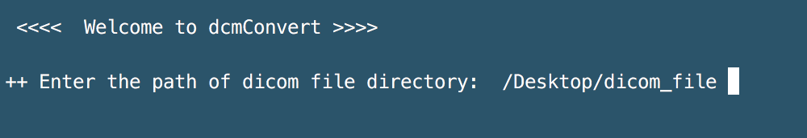
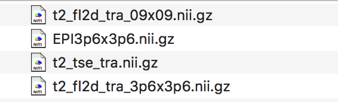
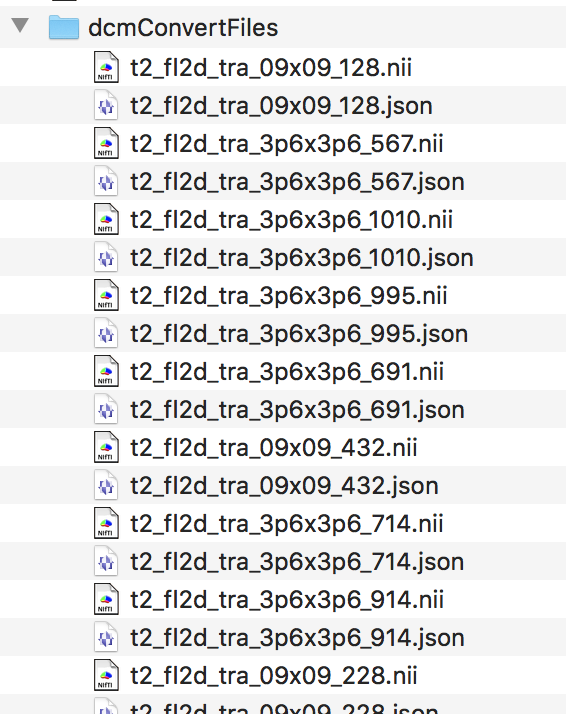

# <font size=6><br>_**dcmConvert.py</br></font> <font size=3>(Automatic multiple DICOM file converting script)**_</font>

## <font color=white>_Feature_</font>
<font size=4>Let's <font color=grean><b>_Convert_</b></font> various DICOM files to <font color=yellow><b>_Nifti files_</b> </font> !!

## Description
+ Python3 based plotting script
+ The script is very simple to use
+ Outputs are "_Converted nifti files_" and "_intermediate nifti file's folder"_


## Requirements
### &nbsp;&nbsp;&nbsp;_dcm2niix_
&nbsp;&nbsp;&nbsp;Please refer this [_website_](https://chromedriver.chromium.org/)
&nbsp;&nbsp;&nbsp;&nbsp;
### &nbsp;&nbsp;&nbsp;_Modules_
&nbsp;&nbsp;&nbsp;&nbsp;
```python setup.py install```


## Usage
+ <b>Run in Terminal</b>
```
python dcmConvert.py
```
+ <b> Just type _a path of dicom directory_</b>



+ <b>Help</b>
```
python dcmConvert.py --help
```

## Outputs
+ Final nifti files


+ Intermediate nifti files


## Version history
+ Version 0.1.0 : The script release (2020.08.22)

## _Contact for Feedback and Bug Reports_
_Uksu, Choi (qtwing@naver.com)_
